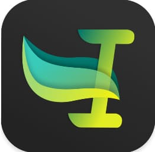

---

This repository contains a collection of tools and resources for automating various tasks and workflows, including security, productivity, and household management. The project aims to provide a centralized platform for managing and integrating these automation tools

### Main Function Points
Provides a collection of automation tools and resources, such as Keyboard Maestro, Automator, and Espanso
Offers guidance and documentation for setting up and using these automation tools
Includes integrations and configurations for various automation workflows
Covers topics related to security, coding conventions, and project management

### Technology Stack
The project utilizes a variety of automation tools and technologies, including:

| Tool | Code |
|:--|:--|
|  | [shell](Homebrew_NPM) |
|  | [Leader Key for the mac](Leader_Key_for_the_mac) |
|  | [Apple Automator](MacOSX_Automator) |
|  | [Espanso](espanso) |
|  | [Cron jobs](Cron_jobs) |
|  | [Apple Shortcuts](https://github.com/imhicihu/shortcuts) |
|  | [Vimium C](Vimium-C) |
|  | [UTM](Virtualization/utm_first_steps_installation.md) |
|  | [dpt files](https://github.com/imhicihu/dotfiles) |

### License
The project is licensed under the MIT License, which allows for free use, modification, and distribution of the code
